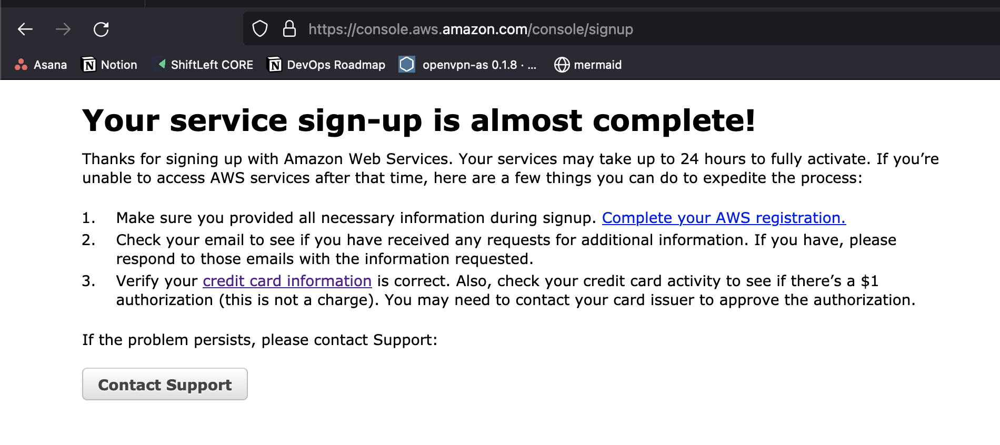

# oozou DevOps Engineer Assignment

### Contents

This repository contains the following files, in support of an application for the role
of **DevOps Engineer** at oozou:

* A `Dockerfile` that containerizes the example application, with support for multiple 
environments (test, development & production)
* A `docker-compose.yml` file that sets up the Node application, `statsd` and the backend.
* Terraform code to deploy this application stack to a Cloud provider


### Exercise One - Dockerfile

The first commit into this repository contains the files provided by oozou, as well as the following:

* .gitignore - To avoid unwanted/unnecessary files being deployed into github
* Dockerfile - Contains the instructions on how to build the Docker container:
  ```yaml
  # syntax=docker/dockerfile:1
  
  # Pull the latest version of node. Note: In production, there may be valid reasons to pin
  # this to a specific version. For this assignment, this author presumes the latest version
  # is sufficient
  FROM node:latest
  
  # Set the NODE_ENV as specified at buildtime
  # Note, this can be overridden
  ARG BUILDTIME_NODE_ENV
  ENV NODE_ENV=$BUILDTIME_NODE_ENV
  
  RUN mkdir -p /app
  WORKDIR /app
  
  COPY app/ /app
  
  RUN if [ "$BuildMode" = "test" ] ; then npm install --only=development; fi
  
  RUN if [ "$BuildMode" = "development" ] ; then npm install --only=development; fi
  
  RUN if [ "$BuildMode" = "production" ] ; then npm install --only=production; fi
  
  CMD ["node", "index.js"]
  ```
  
    This `Dockerfile` can be run using the following command: `docker build --tag node-docker --build-arg BUILDTIME_NODE_ENV=<ENV> .`
    Where `<ENV>` is one of `test`, `development` or `production`.

### Exercise Two - Docker-Compose

This second commit contains updates to this readme file, as well as a couple of small updates to the
Dockerfile, and the creation of the docker-compose.yml `Docker compose` file. 

This `docker-compose` file contains the following configuration:

```yaml
version: "3"
services:
  nodeapp:
    build:
      context: .
      args:
        BUILDTIME_NODE_ENV: test
  graphite-statsd:
    image: graphiteapp/graphite-statsd
    ports:
      # - 127.0.0.1:2003-2004:2003-2004 carbon receiver - plaintext and pickle. Disabled as not used
      # - 127.0.0.1:2023-2024:2023-2024 carbon aggregator - plaintext and pickle. Disabled as not used
      - 127.0.0.1:8125:8125/udp # Statsd metrics
      - 127.0.0.1:8126:8126 # Statsd admin port
      - 127.0.0.1:80:80 # nginx/admin
```

* The nodeJS application is built into a container called "nodeapp" using the **test** ``BUILDTIME_NODE_ENV``. This maps to the conditional `RUN` for **test** in the Dockerfile.
* statsd has been implemented using the community image (graphiteapp/graphite-statds)
* No ports have been exposed on the `nodeapp` and the ports that are available for the `graphite-statsd` container have been set to localhost only.

### Exercise Three - Prepare infrastructure using IaC tooling

### Running the Playbook
A `terraform` infrastructure playbook has been created in the `terraform` folder.

The `oozou.tfvars` file contains the required variables for the script to run.

To validate the playbook for syntactic correctness run:

`terraform validate`

To check the playbook for format correctness run:

`terraform fmt`

> Note: The next steps require access to an AWS account. This can be provisioned either
> via the use of an aws credentials file OR via exporting the environment variables
> `AWS_ACCESS_KEY_ID` and `AWS_SECRET_ACCESS_KEY`

To run the playbook in dry-run (plan) mode:

`terraform plan --var-file=oozou.tfvars`

To apply the playbook run:

`terraform apply --var-file=oozou.tfvars`

### Implementation Details

This playbook consists of three main elements:

* The VPC build, using the community `terraform-aws-vpc` module
* The EC2 build, including implementation of user-data to install the required files and configuration, and
* The Relevant security rules to enable inbound access on port 80 on, and outbound access to/from anywhere (to allow apt updates)

**The VPC Build**

The VPC is built using a standard public/private subnet architecture. As it stands,
the EC2 instance that has been provisioned is in the first public subnet. However, for 
**production** builds, I would recommend that servers sit in the private subnet with load-balancers
in front, for added security. (i.e: If extra ports were accidentally opened to `0.0.0.0`, it 
wouldn't be an issue, as in terms of extrnal traffic, only load balancer traffic on the specified load balancer port can 
access that server)

The EC2 instance is tagged as `Terraform` = `true` for easier fleet management, and it is 
automatically assigned the name `${var.region}-nodeapp`, where var.region is the AWS region the
playbook is being run against - for example ap-southeast-1

**The EC2 Build**

The EC2 build uses the `user_data` attribute of `aws_instance` to inject a bash script for running during
the first boot of the new VM. This script installs all the necessary dependencies to install Docker, and Docker-compose.

Additionally, it creates the `/opt/app/` folder, which is used to inject the `index.js`, `package.json` and `package-lock.json` files
and run docker build to create the docker image. Finally, docker-compose is run to
deploy the application.

Expect a delay of 3-4 minutes after instance launch for everything to be enabled. Once
up and running, a viewer can visit <IP_ADDRESS>:80 in their browser to review the graphite
dashboard, and validate metrics are being generated by the index.js, and recorded in Statsd.

### Exercise Four - Deploy to the Cloud (Optional)

Unfortunately, this Exercise was unable to be completed, as AWS was having issues
accepting my credit card, and despite trying a new one, the account still was not activated in time.



**Please Note**: The Terraform code was run successfully in tests on AWS, on an account a friend provided temporary access to.


### Extra Considerations

I think its important to take a moment to address some of the design decisions
made during this assignement, and why they were made:

**Using Docker/Docker-compose in an EC2 instance:**

Based on the assignment specification there was no guidance here on what was expected.
Certainly, given more time to complete this assignment, a more production-ready setup would be preferred.
This could be Kuberenetes, or something as simple as running a Process Manager, like PM2.

**No HA/Elastic Load Balancer**

Whilst I would never run a single machine in production like this Terraform playbook suggests, I believe it
is sufficient to give the assignment reviewer an understanding of my relative skill levels.

In a production environment, and with more design/delivery time, *at least* there would be an Autoscaling Group of Instances
behind an Elastic Load Balancer, with the instances sitting in the Private Subnets.

**General Security Considerations**

Security is `job zero` for Engineering, and this goes doubly for DevOps staff. At no
point should sensitive endpoints be exposed to the internet, and any portals/dashboards
that need to be exposed should be adequately protected (SSL certificates, username/password, brute force detection, WAF, etc).

### Conclusion

Thank you for taking the time to review this assignment, and I look forward to hearing back from oozou :)
